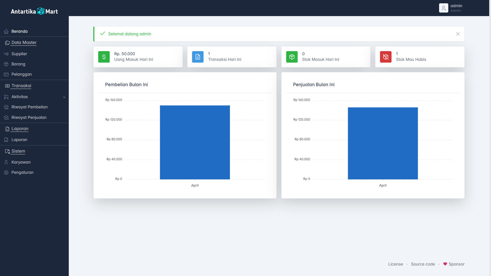
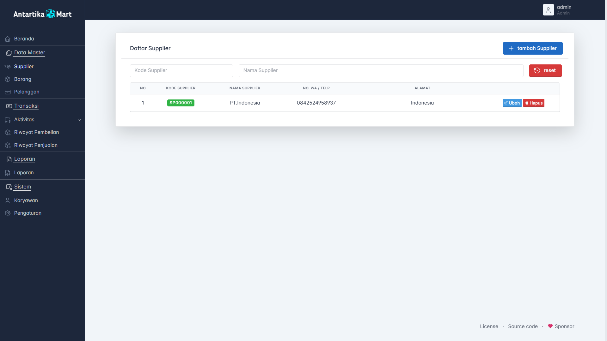
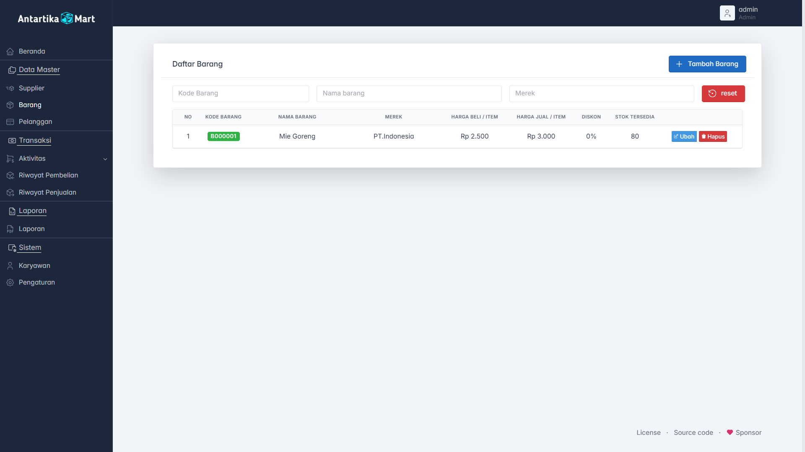

<!-- PROJECT LOGO -->
<p align="center">
  <a href="https://github.com/Aharrisr/project_kasir_ujikom_2025">
    
  </a>
</p>

<h2 align="center">Project Kasir Ujikom 2025</h2>

<p align="center">
  Aplikasi Kasir berbasis Web dengan Laravel 11 untuk keperluan Uji Kompetensi.
  <br />
  <a href="https://github.com/Aharrisr/project_kasir_ujikom_2025"><strong>Explore the docs »</strong></a>
  <br />
  <br />
  <a href="https://github.com/Aharrisr/project_kasir_ujikom_2025/issues">Laporkan Bug</a>
  ·
  <a href="https://github.com/Aharrisr/project_kasir_ujikom_2025/issues">Ajukan Fitur</a>
</p>

---

## 🧾 Daftar Isi

-   [Tentang Proyek](#tentang-proyek)
-   [Built With](#built-with)
-   [Persiapan & Instalasi](#persiapan--instalasi)
-   [Tampilan Aplikasi](#tampilan-aplikasi)
-   [Kontak](#kontak)

---

## 📝 Tentang Proyek

Aplikasi **Kasir Ujikom 2025** merupakan sistem kasir sederhana berbasis web yang dibangun menggunakan Laravel 11. Aplikasi ini mencakup fitur login, dashboard, manajemen barang, transaksi, laporan penjualan, dll.

---

## ⚒️ Built With

### Tools dan Framework

-   [Laravel 11](https://laravel.com)
-   [PHP 8.0+](https://php.net)
-   [Node.js](https://nodejs.org/)
-   [Composer](https://getcomposer.org/)
-   [Git Bash](https://git-scm.com/)

### Library/Plugin

-   [Tabler UI v1.0.0 Beta-16](https://github.com/tabler/tabler)

---

## 🚀 Persiapan & Instalasi

### 1. Clone Repository

```bash
git clone https://github.com/Aharrisr/project_kasir_ujikom_2025.git
cd project_kasir_ujikom_2025
```

### 2. Install Dependencies Laravel

```bash
composer install
```

### 3. Copy & Konfigurasi File Environment

```bash
cp .env_example .env
```

Lalu edit .env:

```bash
DB_CONNECTION=mysql
DB_HOST=127.0.0.1
DB_PORT=3306
DB_DATABASE=db_kasir         # Sesuaikan dengan nama database
DB_USERNAME=root
DB_PASSWORD=                 # Biarkan kosong jika tidak pakai password
```

### 4. Migrasi dan Seed Database

```bash
php artisan migrate --seed
```

Jika ingin reset dan mulai dari awal:

```bash
php artisan migrate:fresh --seed
```

### 5. Jalankan Server Laravel

```bash
php artisan serve
```

Lalu buka di browser:

```bash
http://127.0.0.1:8000/
```

## 📸 Tampilan Aplikasi

### Halaman Login

[](https://github.com/Aharrisr/project_kasir_ujikom_2025.git)

### Halaman Utama

[](https://github.com/Aharrisr/project_kasir_ujikom_2025.git)

### Halaman Supplier

[](https://github.com/Aharrisr/project_kasir_ujikom_2025.git)

### Halaman Barang

[](https://github.com/Aharrisr/project_kasir_ujikom_2025.git)

### Halaman Member/Pelanggan

[](https://github.com/Aharrisr/project_kasir_ujikom_2025.git)

## 📬 Kontak

### Alvitho Harris

📷 Instagram: @aharris\_\_\_<br>
🔗 Project GitHub: https://github.com/Aharrisr/project_kasir_ujikom_2025
