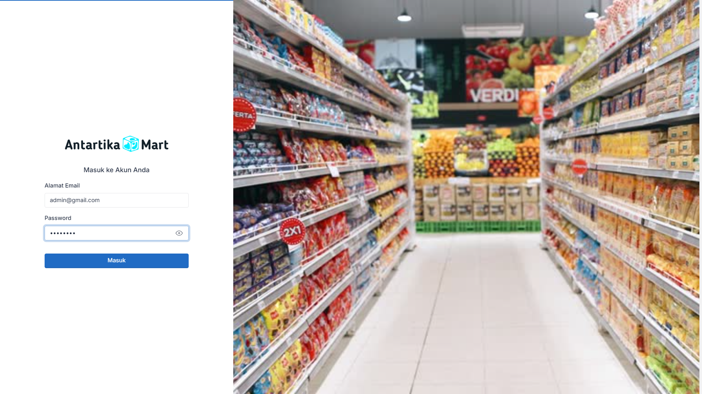
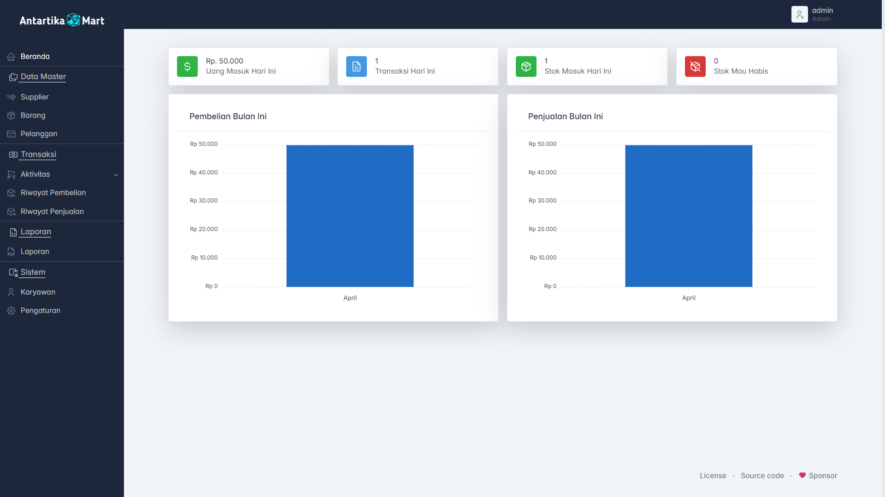

<!--
*** Thanks for checking out the Best-README-Template. If you have a suggestion
*** that would make this better, please fork the repo and create a pull request
*** or simply open an issue with the tag "enhancement".
*** Thanks again! Now go create something AMAZING! :D
-->

<!-- PROJECT SHIELDS -->
<!--
*** I'm using markdown "reference style" links for readability.
*** Reference links are enclosed in brackets [ ] instead of parentheses ( ).
*** See the bottom of this document for the declaration of the reference variables
*** for contributors-url, forks-url, etc. This is an optional, concise syntax you may use.
*** https://www.markdownguide.org/basic-syntax/#reference-style-links
-->

[![Contributors][contributors-shield]][contributors-url]
[![Forks][forks-shield]][forks-url]
[![Stargazers][stars-shield]][stars-url]
[![Issues][issues-shield]][issues-url]
[![LinkedIn][linkedin-shield]][linkedin-url]

<!-- PROJECT LOGO -->
<br />
<p align="center">
  <a href="https://github.com/Aharrisr/project_kasir_ujikom_2025.git">
    
  </a>

  <h3 align="center">Project Kasir Ujikom 2025</h3>

  <p align="center">
    Keterangan Sistem yang dibuat
    <br />
    <a href=""><strong>Explore the docs »</strong></a>
    <br />
    <br />
    <a href="">Report Bug</a>
    ·
    <a href="">Request Feature</a>
  </p>
</p>

<!-- TABLE OF CONTENTS -->
<details open="open">
  <summary>Table of Contents</summary>
  <ol>
    <li>
      <a href="#about-the-project">About The Project</a>
      <ul>
        <li><a href="#built-with">Built With</a></li>
      </ul>
    </li>
    <li>
      <a href="#getting-started">Getting Started</a>
      <ul>
        <li><a href="#prerequisites">Prerequisites</a></li>
        <li><a href="#installation">Installation</a></li>
      </ul>
    </li>
  </ol>
</details>

<!-- ABOUT THE PROJECT -->

## About The Project

1. Login

    [](https://github.com/Aharrisr/project_kasir_ujikom_2025.git)

2. Dashboard

    [](https://github.com/Aharrisr/project_kasir_ujikom_2025.git)

### Built With

This section should list any major frameworks that you built your project using. Leave any add-ons/plugins for the acknowledgements section. Here are a few examples.
Tools and Framework

-   [Laravel 11](https://laravel.com)
-   [PHP 8.0+](https://php.net)
-   [Nodejs](https://node.js)
-   [gitbash](https://git-scm.com/downloads)
-   [composer](https://getcomposer.org/)

Library/Plugin

-   [Tabler 1.0.0 Beta-16](https://github.com/tabler/tabler/releases/tag/v1.0.0-beta16)

<!-- GETTING STARTED -->

## Getting Started

Siapkan terlebih dahulu peralatan perangnya.

<!-- ### Prerequisites

This is an example of how to list things you need to use the software and how to install them.
* npm
  ```sh
  npm install npm@latest -g
  ``` -->

### Installation

<!-- 1. Get a free API Key at [https://example.com](https://example.com) -->

1.  Clone the repo
    ```sh
    git clone https://github.com/Aharrisr/project_kasir_ujikom_2025.git
    ```
2.  Install menggunakan composer
    ```sh
    composer install
    ```
3.  Buat file .env atau copy dan edit file .env_copy kemudian sesuaikan dengan database anda
    ```sh
    cp .env_example .env
    ```
    Ubah di dalam file .env
    ```sh
    B_CONNECTION=mysql
    DB_HOST=127.0.0.1
    DB_PORT=3306
    DB_DATABASE=db_kasir //sesuikan dengan database kalian
    DB_USERNAME=root
    DB_PASSWORD=
    ```
4.  lakukan migrasi database
    ```sh
    php artisan migrate --seed
    ```
    atau migrate:fresh jika ingin dari data kosong
    ```sh
    php artisan migrate:fresh --seed
    ```
5.  jalankan server Laravel
    ```sh
    php artisan serve
    ```

Buka browser dan tulis alamat berikut

```sh
http://127.0.0.1:8000/
```

<!-- LICENSE -->

## License

Distributed under the MIT License. See `LICENSE` for more information.

<!-- CONTACT -->

## Contact

Alvitho Harris - [@aharris___](https://www.instagram.com/aharris___)

Project Link: [https://github.com/Aharrisr/project_kasir_ujikom_2025.git](https://github.com/Aharrisr/project_kasir_ujikom_2025.git)

<!-- MARKDOWN LINKS & IMAGES -->
<!-- https://www.markdownguide.org/basic-syntax/#reference-style-links -->

[contributors-shield]: https://img.shields.io/github/contributors/godgodwinter/inetwork.svg?style=for-the-badge
[contributors-url]: https://github.com/Aharrisr/project_kasir_ujikom_2025/stargazers/graphs/contributors
[forks-shield]: https://img.shields.io/github/forks/godgodwinter/inetwork.svg?style=for-the-badge
[forks-url]: https://github.com/Aharrisr/project_kasir_ujikom_2025/members
[stars-shield]: https://img.shields.io/github/stars/godgodwinter/inetwork.svg?style=for-the-badge
[stars-url]: https://github.com/Aharrisr/project_kasir_ujikom_2025/stargazers
[issues-shield]: https://img.shields.io/github/issues/godgodwinter/inetwork.svg?style=for-the-badge
[issues-url]: https://github.com/Aharrisr/project_kasir_ujikom_2025/issues
[linkedin-shield]: https://img.shields.io/badge/-LinkedIn-black.svg?style=for-the-badge&logo=linkedin&colorB=555
[linkedin-url]: https://www.instagram.com/aharris___
